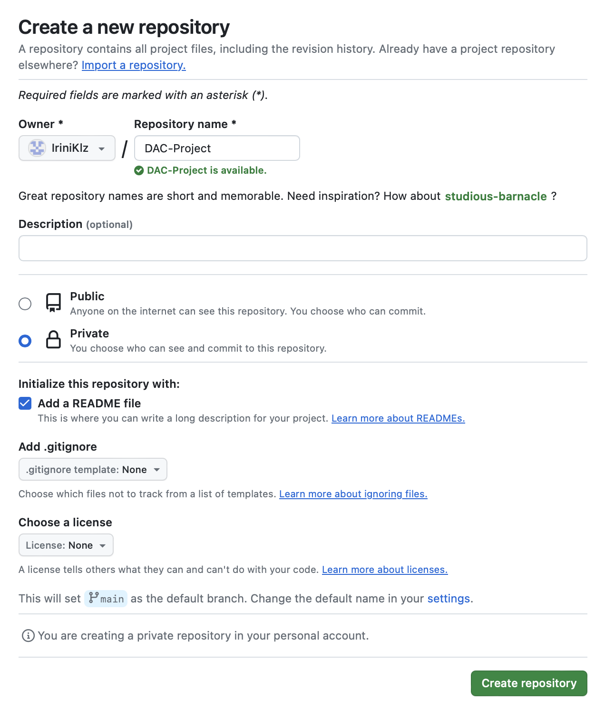
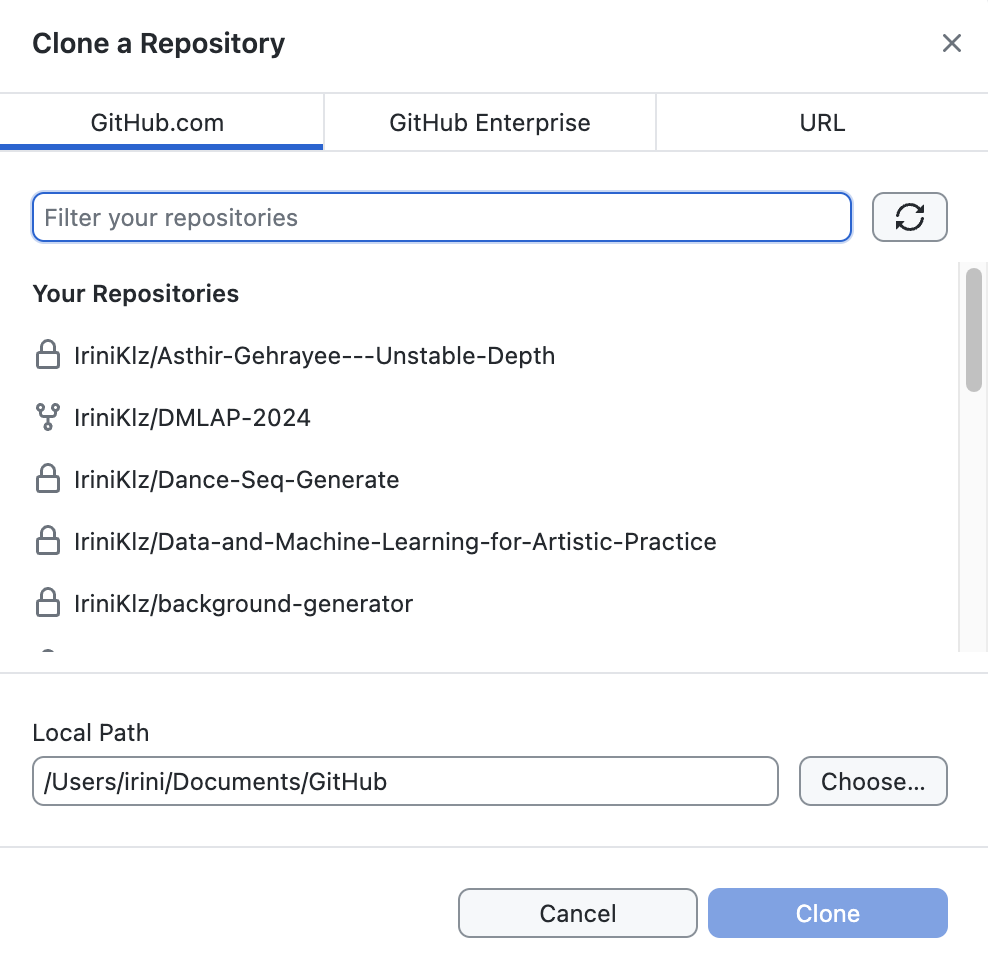

## **Github Setup**

In and outside of this module, you might want to clone and use open-source code that exists in Github repositories (repos), or you might want to set up your own Github repo where you could push all the materials of a certain project. The following instructions are meant to facilitate these processes.

Before you proceed further, you need to [follow these instructions](https://github.com/git-guides/install-git) in order to install git on your OS.

You will also need a github account. If you do not already have one, you need to set up an account by following [these instructions](https://docs.github.com/en/get-started/quickstart/creating-an-account-on-github).

### Creating a Project Repo

If you wish to create your own Github repo:

- Go to your online GitHub page and press the `+` symbol to create a new repo, as shown below:

- Give a name to your repo, make it private or public and add a readme file to it, as shown below:

- Create your repo!

- You can always edit your repo (the existing readme file or any new files) from the web interface and commit changes directly there. Remember to add a meaningful commit message whenever you make a change! This will help you (and any other contributors) keep track of all changes.

By the time you have created your repo, you can manage it by following either one of the following options.

### Managing the Project Repo - Option #1: Github Desktop

- Download Github Desktop from [here](https://desktop.github.com/).

- Clone your repo by selecting `Add` --> `Clone a Repository` --> `Github.com`. Your existing repos will show up and from there, you can select the one you wish to clone. Select the local path of your choice. This is where your repo will be stored locally.

- Now whenever you make a change (adding, removing, editing files on VS Code or other editors) to the files that exist in this local repo, the changes will show up as `changed files` in GitHub Desktop. Then, similarly to what you do on the web interface when commiting changes, you need to add a commit message for your changes and commit them.

- Finally, you need to `push` the changes, so that the remote repository syncs up with the changes that you made locally. Voila!

### Managing the Project Repo - Option #2: Command Line

- Open the terminal/command line and move to the directory where you want to store your repo, by typing the command `cd` along with the path to the directory, e.g.: `cd documents/github`

- Then type in `git clone` and add the HTTPS link to your git repo: `git clone https://github.com/...`

- From this point onwards, you can make changes to your project (adding, removing, editing files on VS Code or other editors) and saving the changes locally. Whenever you want to commit these changes and push them into your remote repository, you need to open the terminal/command line and...

- Move into the directory of your project by typing `cd path-to-your-directory`

- Check the status of your git repo by typing `git status`. This will tell you whether there are local changes that haven't been commited yet, while also providing the name of the file(s) that has/have been edited. 

- Type in `git add name-of-the-edited-file`. This will tell git to keep track of the edited file(s).

- Then commit the change(s) by typing `git commit -m "your-commit-message"`.

- Then push the changes to the remote repo by typing `git push`. Voila!

### Additional Notes on Creating your own Repo

- It might be preferable to only do changes locally and then push them into the remote repo, instead of sometimes editing your files on the web interface and other times locally. If you decide to the latter, you will need to also `pull` changes from the remote repo and you might get confused while trying to keep the two repos synced.

- There is an option #3 for managing the project repo, which involves setting up Git in VS Code. If you want to process with this option, feel free to follow through [these instructions](https://code.visualstudio.com/docs/sourcecontrol/intro-to-git).

### Cloning a Repo from an external source

To clone a repository from an external source, you need to follow the exact same steps as above, with whichever option of your choice (Github Desktop or terminal) until the step where you have downloaded the repo on your computer and stored it in a specific directory. By the time you have done that, you can access the files of the repo and modify them as you wish. Your changes will not affect the original repo. You cannot push changes into it since you are not the creator of that repo.
